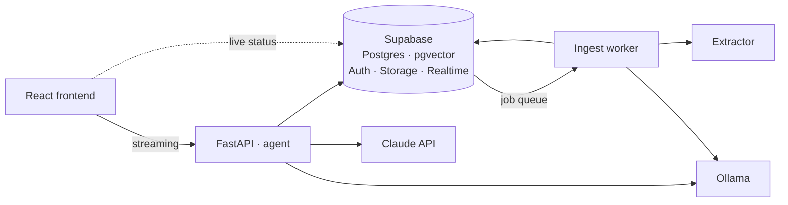

# TRAG

**Ask questions about your own documents, and get answers you can check.**

Upload a PDF, a spreadsheet, a stack of lecture slides. Ask a question in plain
language. TRAG finds the relevant passages, answers from them, and shows you
exactly which file, section and paragraph each claim came from.

And when your documents don't contain the answer, it says so.

---

## Why that last part matters

Most retrieval systems always return something. Ask about a topic your files
never mention and you'll still get five passages and a confident paragraph
built out of them — because the machinery had no way to say "nothing here fits".

That failure is quiet. The answer looks exactly like a correct one. You only
discover it when you go and check, which is the thing the tool was supposed to
save you from.

TRAG is built around making that impossible. A relevance gate reads each
candidate passage *against your actual question* and can decline the whole
query. Getting this to work took a real measurement: it turns out embedding
similarity cannot tell a genuine question from gibberish — both score around
0.5 — so the gate had to be built on something that can.

> Nonsense query: 0.483 · Real question: 0.500 — no threshold separates them.

---

## What it can do

**Read almost anything you upload.** PDF, Word, PowerPoint, Excel, CSV, HTML,
Markdown, plain text and images. Charts and figures are described by a local
vision model, so a question about a graph can actually find it.

**Search two ways at once.** Meaning-based search finds passages that answer
your question in different words. Keyword search finds exact terms — a part
number, a name, "Holt's model" — that meaning-based search blurs away. Neither
alone is enough; they fail on completely different questions, so TRAG runs both
and merges the results.

**Answer questions *about* your collection, not just inside it.** "How many
documents do I have from 2024?" is a different kind of question from "what does
chapter 7 say about forecasting". TRAG recognises the difference and reaches for
a different tool.

**Count exactly.** "How many of my files mention forecasting?" gets a real
number, counted across every document — not the size of a search result, which
would only ever measure the search.

**Show its work.** Every answer carries its sources: file, section, passage and
relevance. Metadata answers show the query that produced them. Web results are
labelled as coming from outside your documents.

**Stay yours.** Every table is protected by row-level security, so one account
can never read another's files — enforced by the database itself, not by the
application asking nicely.

---

## How it works

Two journeys: getting a document *in*, and getting an answer *out*.

### Getting a document in

```
 upload → extract → describe figures → pull out metadata → split → embed → ready
```

The file is stored, then a background worker picks it up. Text and tables are
extracted, figures are captioned by a vision model, and an LLM pulls out the
title, type, source and topics. The text is then split into passages of roughly
800 tokens that follow the document's real headings rather than arbitrary
boundaries, and each is turned into a vector for searching.

One detail worth calling out, because it is the difference between a passage
being findable and invisible: a chunk reading *"margins fell 4% year over year"*
never says **whose** margins. So the document title and heading path are
prepended before embedding — the passage becomes retrievable by its own subject,
without those words being fed back to the model as if they were part of the
text.

You watch all of this happen live. Status flows straight from the database to
your browser, so the badge moves through *extracting → analyzing → chunking →
embedding → ready* without a refresh.

### Getting an answer out

```
 question → the agent picks a tool → retrieve → is any of this relevant? → answer with sources
                                                          │
                                                          └─ no ──→ "I don't have that"
```

The agent decides what the question needs. For a content question, both search
channels run, their rankings are merged, and a cross-encoder re-reads the
survivors against your question — this is the step that can decline. What
survives goes to Claude along with an instruction not to fill gaps from general
knowledge.

If you named a specific file, the search is narrowed to it inside the database,
*before* ranking. Doing it afterwards would mean discarding whatever the ranking
already picked — for a set of related chapters, usually everything.

---

## Architecture



| Piece | What it does |
|---|---|
| **API** | Authentication, chat, uploads, streaming responses |
| **Extractor** | Reads documents. Separate on purpose — see below |
| **Worker** | Drains the ingest queue: extract, caption, chunk, embed |
| **Supabase** | Postgres with vector search, plus auth, file storage and live updates |

The extractor is its own process because the document-reading library wraps
native code that can crash hard. It did once, taking the whole API down with it.
Isolated, a bad file costs one document instead of the server — and that same
isolation later turned out to be what lets ingestion run on a completely
different machine.

### Under the hood

| Layer | Choice |
|---|---|
| Frontend | React · TypeScript · Vite · Tailwind |
| Backend | Python · FastAPI · server-sent events |
| Agent | LangGraph · LangChain tools |
| Model | Claude (Anthropic Messages API) |
| Database | Supabase — Postgres, pgvector, Auth, Storage, Realtime |
| Embeddings | `nomic-embed-text` via Ollama |
| Relevance | `ms-marco-MiniLM-L-6-v2` cross-encoder |
| Reading files | docling · `qwen2.5vl` for figures |
| Tracing | LangSmith |

---

## Getting started

### You'll need

- Python 3.11+ with [uv](https://docs.astral.sh/uv/), and Node.js 18+
- A [Supabase](https://supabase.com) project (free tier is fine)
- An [Anthropic API key](https://console.anthropic.com)
- [Ollama](https://ollama.com), with two models pulled:

  ```bash
  ollama pull nomic-embed-text
  ollama pull qwen2.5vl:7b
  ```

An NVIDIA GPU is optional but very welcome — relevance scoring uses it
automatically and is roughly 15× faster there.

### Install

```bash
uv sync
cd frontend && npm install
```

### Set up the database

Run the five files in [`supabase/schema/`](supabase/schema/) **in order**, in
the Supabase SQL editor. Each one ends with a commented block of checks worth
running — a file that applied cleanly and a schema that works are different
claims.

Then create an account for the ingest worker and register it:

```sql
insert into public.ingest_workers (user_id, label)
select id, 'local-worker' from auth.users
 where email = 'worker@trag.invalid';
```

> Use a non-routable domain like `.invalid` so the account can't be recovered
> by email. **Skip this step and nothing will ever finish processing** — uploads
> will sit at *pending* forever with no error to explain why.

### Configure

Create `.env` in the project root:

```ini
SUPABASE_URL=
SUPABASE_PUBLISHABLE_KEY=
ANTHROPIC_API_KEY=

INGEST_WORKER_EMAIL=
INGEST_WORKER_PASSWORD=

CORS_ORIGINS=http://localhost:5173

# Frontend — only VITE_ variables reach the browser
VITE_SUPABASE_URL=
VITE_SUPABASE_PUBLISHABLE_KEY=
VITE_API_BASE_URL=http://127.0.0.1:8000

# Optional
LANGSMITH_TRACING=true
LANGSMITH_API_KEY=
```

> **Never prefix `ANTHROPIC_API_KEY` with `VITE_`.** Anything starting with
> `VITE_` is compiled into the JavaScript everyone downloads.

[`.env.example`](.env.example) documents every setting, including the tuned
defaults and what each one costs you if changed.

### Run it

Four terminals, from the project root:

```bash
uv run uvicorn backend.app.main:app --port 8000     # API
uv run uvicorn backend.extractor.main:app --port 8001  # Extractor
uv run python -m backend.worker.main                # Ingest worker
cd frontend && npm run dev                          # Frontend
```

Ollama needs to be running too. Open **http://localhost:5173**.

---

## Deploying it

Serving and ingesting have opposite needs. Serving is light, always-on and
latency-sensitive. Ingesting is heavy, occasional, and wants a GPU. Paying for a
machine big enough to caption figures, 24 hours a day, to use it 1% of the time,
is a bad trade.

So they're split:

```
                    ┌─ server, always on ────────────────┐
  browser ─────────▶│  Caddy → API + agent               │
                    │  Ollama (embeddings only)          │
                    │  relevance scoring (CPU)           │
                    └──────────────┬─────────────────────┘
                                   │
                            Supabase (hosted)
                                   │
                    ┌──────────────┴─ workstation, when it's on ─┐
                    │  ingest worker → extractor                 │
                    │                → vision model → GPU        │
                    └────────────────────────────────────────────┘
```

This needed **no code changes at all**, which is the nice part. The job queue
already lived in Postgres so that ingestion could survive a server restart —
and a queue that survives a restart turns out to be a queue that doesn't care
which continent the worker is on. The worker never talks to the API; it only
claims jobs from the database.

With the workstation off, chat, search and citations all keep working. Uploads
are accepted and wait. Switch it on and the queue drains, with each status
change appearing live in the browser — driven by a machine on someone's desk.

```bash
cp .env.deploy.example .env       # on the server, then fill it in
cd frontend && npm run build      # VITE_API_BASE_URL must be the public URL
docker compose up -d --build
```

**Five things that cost an afternoon if you miss them:**

1. **Turn off public signup in Supabase before sharing the URL.** Quotas limit
   what one account can do — not how many accounts exist. Every signup spends
   your Anthropic credit. Set a billing limit too.
2. **Build the image on the server**, not on your laptop. The local setup pins a
   CUDA build of PyTorch that doesn't exist for the server's architecture.
3. **Rebuild the frontend when the API address changes.** It's baked in at build
   time; restarting does nothing.
4. **Caddy needs a hostname, not an IP address.** Certificates are then issued
   automatically — there's no certificate step to run.
5. **Cloud providers often have two firewalls** — theirs and the machine's own.
   Traffic allowed by one and blocked by the other looks like a hang, not a
   refusal.

---

## Is it any good?

It's measured rather than assumed. Two test suites run against a set of
questions with known answers.

**Retrieval** — does the right passage come back?

| Approach | Finds the answer | Knows when to decline |
|---|---|---|
| Meaning-based only | 77.8% | 0% |
| Keyword only | 66.7% | 100% |
| Both, merged | 88.9% | 0% |
| Both + relevance gate | **100%** | **100%** |

The last row is the whole argument. Merging the two searches ranks *perfectly* —
and still scores 88.9%, because merging produces no score you can threshold on,
so it happily returns passages for a question it should refuse. Ranking well and
knowing when to stay quiet are separate skills.

**Answers** — does the agent behave? This one drives the real thing and checks
what retrieval scores can't see: did it pick the right tool, did a search naming
one file actually get scoped to it, did a passage leak in from the wrong
document, did the answer cite something no tool returned.

```bash
uv run python -m backend.evaluation.run       # retrieval
uv run python -m backend.evaluation.answers   # agent behaviour
```

Every question runs three times, and results are reported as `2/3` rather than
averaged. The agent isn't deterministic, and a partial pass is more dangerous
than a clean failure — it looks like success on a lucky run. Nothing here is
graded by another language model; every check is mechanical.

### Speed

| | Before tuning | Now |
|---|---|---|
| One user | 3637 ms | **195 ms** |
| Ten users at once (p95) | 15305 ms | **1045 ms** |

Retrieval for ten simultaneous users is now faster than it used to be for one.
Two of the three fixes were embarrassing rather than clever — one was a hostname
resolving over IPv6 and waiting for a timeout, costing two full seconds per
request. [`findings.md`](findings.md) has the details.

Multi-turn conversations also cost about **half** what they did, because the
conversation prefix is cached between turns rather than re-sent at full price.

---

## Some decisions worth explaining

**Filtering happens in the database, before ranking.** Narrowing results
afterwards can only throw away rows the ranking already chose — so a filter that
excludes the top 5 gives you nothing instead of the next 5.

**Narrowing to one document doesn't lower the bar.** Scoping a search changes
which passages are *considered*, not how good they have to be. Ask a document
something it doesn't cover and you still get "I don't have that", not the least
bad paragraph in it.

**The SQL tool is limited by database permissions, not by inspecting the SQL.**
The model writes real queries, which run as a role that can read exactly one
view and nothing else. `delete from documents` fails because the permission
isn't there — not because a pattern matched. Checking model-written SQL with
pattern rules always leaks; permissions don't.

**Web search only exists when you ask for it.** Not disabled — *absent*. If you
haven't ticked the box, the tool isn't offered to the model, so it cannot be
called by accident.

**Counting is a tool, not an instruction.** Telling the model to be careful
about counts worked two times out of three. A question that can be answered
exactly should be answered exactly, so counting became a database function.

**Conversations live in Postgres**, not in the agent framework's memory. Your
chats survive restarts, reloads and refactors because they're rows.

**Deleting a document deletes everything derived from it**, by foreign key. No
orphaned passages, no citations pointing at a file that's gone.

---

## What's inside

```
backend/
  app/
    agent.py        the agent and its tools
    retrieval.py    hybrid search, merging, the relevance gate
    rerank.py       cross-encoder scoring
    chunking.py     splitting documents, building embedding text
    sql_tool.py     questions about the collection itself
  extractor/        reads documents, isolated from the API
  worker/           drains the ingest queue
  evaluation/       the test suites
frontend/src/       the React app
supabase/schema/    tables, security policies, search functions
findings.md         every measurement, and what was learned the hard way
```

---

## Limits

Per account, enforced by the database:

| | |
|---|---|
| Chats | 5 |
| Storage | 100 MB |
| Messages per chat | 200 |
| Single upload | 25 MB |

## Not doing (for now)

**Knowledge graphs.** Extracting entities and relationships costs a model call
per passage, and a wrong relationship is very hard to trace back to its source.
Worth revisiting only if the evaluation set starts showing multi-hop questions
failing consistently.

**Automatic connectors.** Ingestion is manual upload. No Drive sync, no crawlers.
