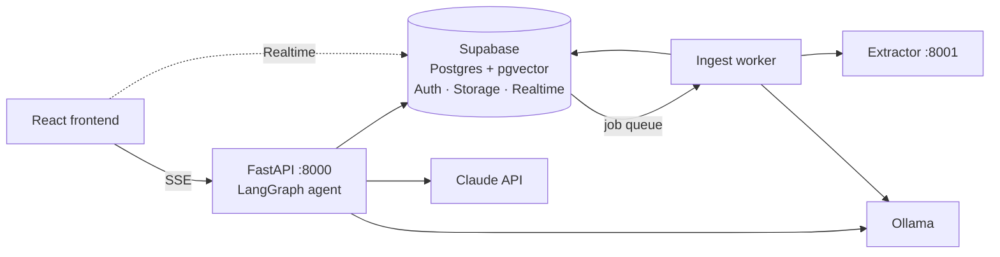

# TRAG

An agentic RAG application. Users upload documents and ask questions about them.
An LLM agent selects between semantic search over document passages, SQL over
document metadata, and optional web search.

Answers cite the file, section and passage they came from. When retrieval finds
nothing relevant, the agent reports that instead of answering from the model's
general knowledge.

## Features

- **Multi-format ingestion** — PDF, DOCX, PPTX, XLSX, CSV, HTML, Markdown, plain
  text and images. Figures are captioned by a local vision model.
- **Hybrid retrieval** — dense vectors (pgvector/HNSW) and Postgres full-text
  search fused with Reciprocal Rank Fusion, then reordered by a cross-encoder.
- **Agentic tool routing** — three tools, selected by the model:
  | Tool | Purpose |
  |---|---|
  | `search_documents` | Semantic search over document contents |
  | `query_document_metadata` | Read-only SQL over document metadata |
  | `web_search` | Web search, enabled per message by the user |
- **Source attribution** — per-channel. Passages show file, section, chunk and
  relevance score; SQL answers show the executed query; web results are labelled
  as external.
- **Abstention** — a calibrated relevance gate returns "no relevant information"
  rather than a low-confidence answer.
- **Durable ingestion** — a Postgres job queue with `FOR UPDATE SKIP LOCKED`,
  stale-claim reclamation and exponential retry backoff.
- **Row-Level Security** on every table. The backend uses no `service_role` key.
- **Retrieval evaluation** — a golden question set scored on hit rate, MRR and
  nDCG, per channel.
- **Per-user quotas** enforced by database triggers.

## Tech stack

| Layer | Technology |
|---|---|
| Frontend | React, TypeScript, Vite, Tailwind CSS |
| Backend | Python, FastAPI, server-sent events |
| Agent | LangGraph (`create_agent`), LangChain tools |
| LLM | Claude via the Anthropic Messages API |
| Database | Supabase — Postgres, pgvector, Auth, Storage, Realtime |
| Embeddings | `nomic-embed-text` via Ollama (768 dimensions) |
| Reranking | `cross-encoder/ms-marco-MiniLM-L-6-v2` (PyTorch, GPU) |
| Extraction | docling; `qwen2.5vl` for figure captioning |
| Observability | LangSmith |

## Architecture



The backend runs as three processes:

| Process | Port | Responsibility |
|---|---|---|
| API | 8000 | Authentication, chat, uploads, streaming |
| Extractor | 8001 | Document extraction (docling), isolated from the API |
| Worker | — | Consumes the ingest queue: extract, caption, chunk, embed |

The extractor is a separate process because docling's converter is not
thread-safe; a failure there affects one document rather than the API.

## Prerequisites

- Python 3.11+ and [uv](https://docs.astral.sh/uv/)
- Node.js 18+
- A Supabase project (Postgres with pgvector, Auth, Storage)
- An Anthropic API key
- [Ollama](https://ollama.com) with two models:
  ```bash
  ollama pull nomic-embed-text
  ollama pull qwen2.5vl:7b
  ```
- Optional: an NVIDIA GPU. Reranking uses it automatically when available.

## Installation

```bash
uv sync
cd frontend && npm install
```

## Configuration

### 1. Database

Apply the migrations in `supabase/migrations/` in order using the Supabase SQL
editor. Each file ends with a commented verification block.

> `0010` does not exist. The sequence number was reserved for a change that
> required no migration.

### 2. Ingest worker account

The worker authenticates as a standard Supabase user, so RLS applies to it.
Create the account, then register it:

```sql
insert into public.ingest_workers (user_id, label)
select id, 'local-worker' from auth.users
 where email = 'worker@trag.invalid';
```

Use a non-routable domain such as `.invalid` (RFC 2606) so the account cannot be
recovered through email.

### 3. Environment

Create `.env` in the repository root:

```ini
SUPABASE_URL=
SUPABASE_PUBLISHABLE_KEY=
ANTHROPIC_API_KEY=

INGEST_WORKER_EMAIL=
INGEST_WORKER_PASSWORD=

CORS_ORIGINS=http://localhost:5173

# Frontend — only VITE_-prefixed variables are exposed to the browser
VITE_SUPABASE_URL=
VITE_SUPABASE_PUBLISHABLE_KEY=
VITE_API_BASE_URL=http://127.0.0.1:8000

# Optional
LANGSMITH_TRACING=true
LANGSMITH_API_KEY=
```

`ANTHROPIC_API_KEY` must not be given a `VITE_` prefix.

## Running

Four terminals, from the repository root:

```bash
# API
uv run uvicorn backend.app.main:app --host 127.0.0.1 --port 8000

# Extractor
uv run uvicorn backend.extractor.main:app --host 127.0.0.1 --port 8001

# Ingest worker
uv run python -m backend.worker.main

# Frontend
cd frontend && npm run dev
```

Ollama must be running. The application is served at http://localhost:5173.

## Evaluation

Retrieval is scored against a golden question set. The harness makes no LLM
calls and is used as the regression test for retrieval changes.

```bash
uv run python -m backend.evaluation.run --channels vector,keyword,rrf,reranked
```

Current results:

| Channel | Hit rate | MRR | nDCG |
|---|---|---|---|
| Vector only | 85.7% | 0.857 | 0.857 |
| Keyword only | 71.4% | 0.714 | 0.714 |
| RRF fusion | 100% | 1.000 | 1.000 |
| RRF + reranked | 100% | 1.000 | 1.000 |

## Performance

Measured per stage on a 16-core machine with an RTX 3060, 20 rerank candidates.

| Stage | Before optimisation | Current |
|---|---|---|
| Query embedding | 2295 ms | 46 ms |
| Reranking | 1260 ms | 80 ms |
| Full retrieval, 1 concurrent user | 3637 ms | 195 ms |
| Full retrieval, 10 concurrent users (p95) | 15305 ms | 1045 ms |

Load tested at 1, 3, 5 and 10 concurrent users with no errors.

## Design decisions

- **Metadata filters are applied inside the database function, before ranking.**
  Filtering the top-k afterwards can only discard rows the ranking already
  selected.
- **The text-to-SQL tool is scoped by Postgres grants.** Model-written SQL
  executes inside a function owned by a `nologin` role with `SELECT` on one
  allowlisted view. Access to other tables fails on permissions, not on input
  validation.
- **Web search is gated by capability.** When the user has not enabled it, the
  tool is not passed to the model, so it cannot be called.
- **Retrieval is not implemented with LangChain abstractions.** Hybrid search,
  RRF fusion, reranking and the abstention gate are tuned against the golden
  set and are wrapped as a LangChain tool rather than replaced, so evaluation
  results remain comparable across refactors.
- **Postgres is the source of truth for conversations**, not a LangGraph
  checkpointer. Messages are converted at the agent boundary.
- **The content hash covers extraction configuration**, not only file bytes, so
  a chunking or prompt change marks documents stale.
- **Document deletion is a foreign-key cascade**, so derived data cannot outlive
  its source.

## Project structure

```
backend/
  app/
    agent.py        LangGraph agent and tool definitions
    retrieval.py    Hybrid search, RRF fusion, abstention gate
    rerank.py       Cross-encoder reranking
    sql_tool.py     Text-to-SQL over document metadata
    chunking.py     Chunking and embedding input construction
    routers/        Chat, threads, files
  extractor/        Document extraction service
  worker/           Ingest queue consumer
  evaluation/       Golden-set retrieval metrics
frontend/
  src/              React application
supabase/
  migrations/       Schema, RLS policies, RPC functions
```

## Limits

Per user, enforced by database triggers:

| Limit | Value |
|---|---|
| Chats | 5 |
| Storage | 100 MB |
| Messages per chat | 200 |
| Upload size | 25 MB |

## Out of scope

- **GraphRAG** — entity extraction costs an LLM call per chunk, and incorrect
  relationships are difficult to trace back. Revisit only if evaluation shows a
  consistent failure class of multi-hop questions.
- **Automated connectors** — ingestion is manual upload only.
